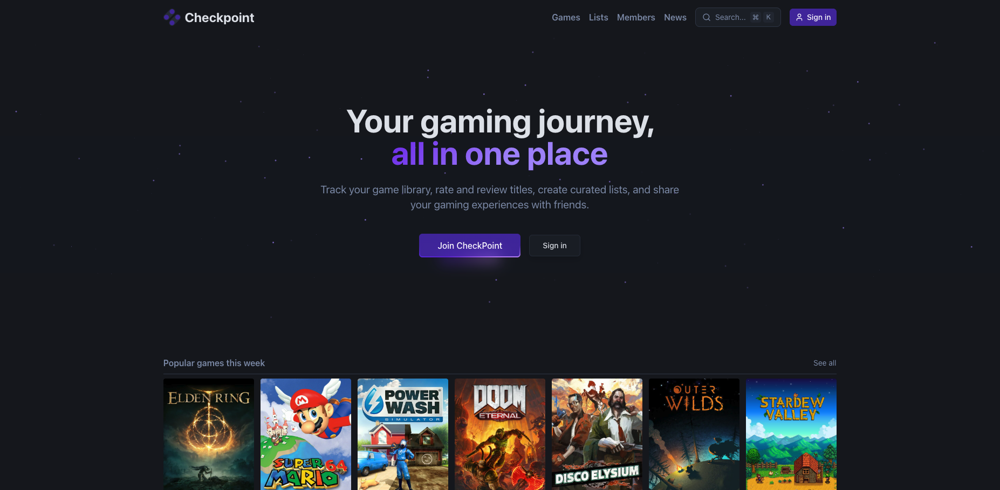

  

<h1 align="center">CheckPoint</h1>

  <strong>Your unified video game library tracker</strong>

  <a href="#about">About</a> •
  <a href="#features">Features</a> •
  <a href="#tech-stack">Tech Stack</a> •
  <a href="#documentation">Documentation</a> •
  <a href="#want-to-contribute">Contributing</a> •
  <a href="#code-of-conduct">Code of Conduct</a> •
  <a href="#security">Security</a> •
  <a href="#authors">Authors</a>

  
  
  
  
  

---

  

---

## About

**CheckPoint** addresses a concrete need identified among video game players: the fragmentation of their game libraries across multiple platforms. It offers a centralized solution allowing users to:

- Track their progress and manage their **backlog**
- Organize their **wishlist**
- Rate and review games
- Interact with a **community** of players
- Earn **XP and badges** through gamification

---

## Features

### For Players (Web Application)
- Secure authentication with 2FA support
- Personal game library management (in progress, finished, wishlist)
- Rating and review system
- Follow friends and see their activity
- Advanced fuzzy search with filters
- Game recommendations based on preferences
- Gamification with XP, levels, and badges

### For Administrators (Web Admin Panel)
- User management (block, promote, view history)
- Content moderation (review reports queue)
- API synchronization with MobyGames/IGDB
- Analytics dashboard with charts
- Manual game entry CRUD operations

---

## Tech Stack

### Backend
| Technology | Purpose |
|------------|---------|
| **Spring Boot 3** | REST API framework |
| **Spring Security** | Authentication & authorization |
| **Spring Data JPA** | Database persistence |
| **Spring Batch** | Data import jobs |
| **Hibernate Search** | Full-text fuzzy search |
| **PostgreSQL** | Relational database |
| **SpringDoc OpenAPI (Swagger UI)** | Interactive API documentation |
| **JaCoCo** | Code coverage (enforced ≥ 70%) |

### Web Frontend
| Technology | Purpose |
|------------|---------|
| **TanStack Start** | React meta-framework with SSR |
| **React** | UI library |
| **Tailwind CSS** | Styling |
| **Shadcn UI** | Component library |

### Infrastructure
| Technology | Purpose |
|------------|---------|
| **Nix + devenv** | Reproducible development environment |
| **Docker** | Containerization |
| **Traefik** | Reverse proxy & SSL |
| **Docker Swarm** | Container orchestration |

---

## Documentation

Everything about building, running and testing the project lives in the
[Contributing Guide](CONTRIBUTING.md). The rest is reference material:

| Document | Description |
|----------|-------------|
| [Contributing Guide](CONTRIBUTING.md) | Setup, running, testing, conventions, PR workflow |
| [API README](api/README.md) | REST API overview and module layout |
| [Specifications](docs/specifications/requirements.md) | The project requirements as delivered |
| [Architecture](docs/architecture/) | System architecture diagram |
| [UML Diagrams](docs/uml/) | MCD and use case diagrams |
| [Design](docs/design/) | Graphic charter and style guide |
| [Mockups](docs/assets/mockups/) | UI/UX mockups |
| [Archived modules](ARCHIVE.md) | The retired JavaFX console and Slidev deck |

---

## Want to contribute?

Contributions are welcome. The [Contributing Guide](CONTRIBUTING.md) covers
everything you need: the local setup with Nix or by hand, how to run each
module, the testing and quality gates, branch naming, Conventional Commits, and
the pull request process.

In short:

1. Fork the repository and create a branch from `main`.
2. Make your change, and run the tests for the modules you touched.
3. Open a pull request. The [template](.github/PULL_REQUEST_TEMPLATE.md) loads
   automatically, so fill in every section.

Bug reports and feature ideas are just as welcome: open an
[issue](https://github.com/gauthier-se/checkpoint/issues) and pick the matching
template.

---

## Code of Conduct

This project adheres to a [Code of Conduct](CODE_OF_CONDUCT.md) based on the
Contributor Covenant. By participating you are expected to uphold it. Report
unacceptable behavior to the contacts listed there.

---

## Security

Found a vulnerability? Please **do not** open a public issue. The
[Security Policy](SECURITY.md) explains how to report it privately and what to
expect once you do.

---

## Authors

- **Enzo CHABOISSEAU**
- **Gauthier SEYZERIAT--MEYER**

---

## License

This project is released under the [MIT License](LICENSE), see the `LICENSE`
file for details. It was originally built as part of an academic program at
**CCI Campus Alsace**.

---

  Made with ❤️ for gamers

