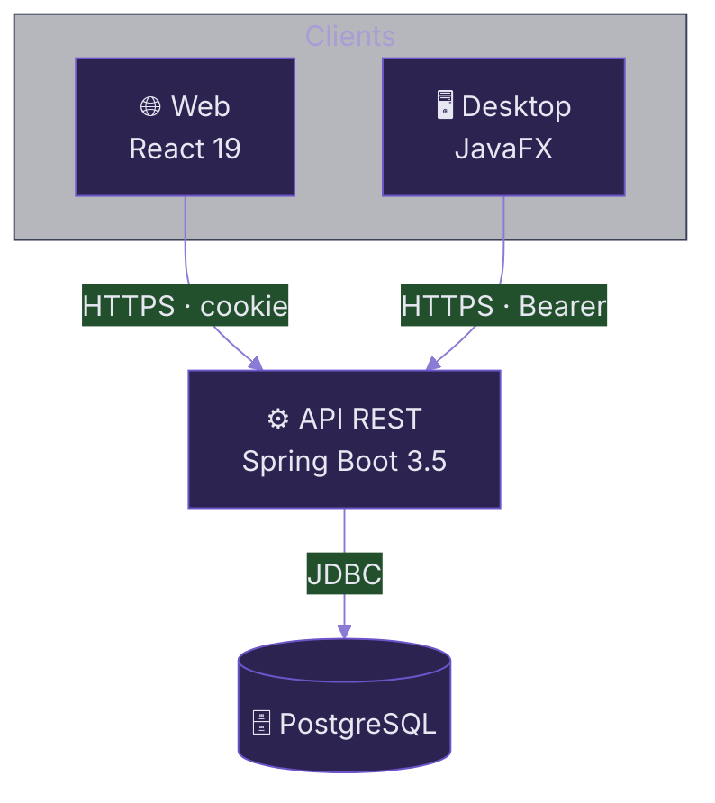
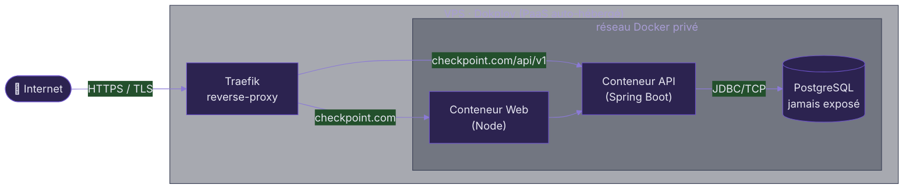
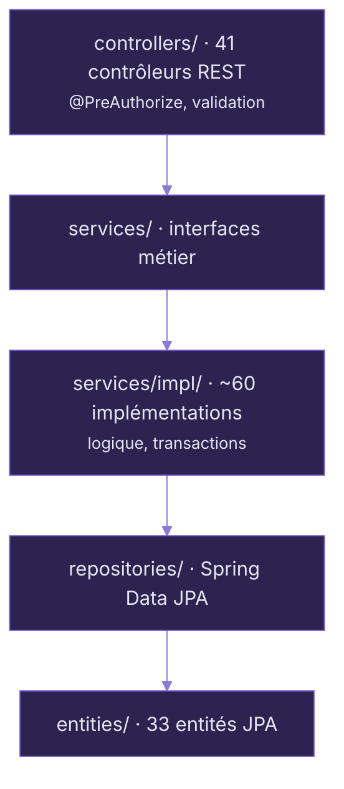

# Architecture du projet

Monorepo, déploiement, et l'intérieur de chaque application.

---
layout: default
---

# <span class="cp-accent-bar">Vue d'ensemble — un monorepo</span>

<div class="grid grid-cols-2 gap-6 mt-2">

<div>

Un seul dépôt Git pour les trois modules → cohérence et traçabilité.

```bash
checkpoint/
├── api/        → Spring Boot (Maven)    le backend
├── web/        → TanStack Start (pnpm)  client joueur
├── desktop/    → JavaFX (Maven)         console admin
├── doc/        → specs, UML, MCD, .http
└── .github/    → CI (api-ci, web-ci), templates
```

<div class="flex gap-2 mt-3 flex-wrap">
  <TechPill icon="i-carbon-logo-github">1 dépôt</TechPill>
  <TechPill icon="i-carbon-box">3 applications</TechPill>
  <TechPill icon="i-carbon-flow">CI scopée par chemin</TechPill>
</div>

</div>

<div>



</div>

</div>

<!--
Le monorepo simplifie la cohérence : un seul endroit pour les trois apps,
la doc et la CI. La CI est scopée par chemin : on ne relance pas tout à chaque PR.
-->

---
layout: default
---

# <span class="cp-accent-bar">Déploiement en production</span>



<div class="grid grid-cols-3 gap-3 mt-3 text-[0.8rem]">
  <div class="cp-card !p-3"><carbon:security class="text-lg" style="color:oklch(0.7 0.15 286)"/> <strong>Traefik</strong> — point d'entrée unique, terminaison HTTPS/TLS automatique.</div>
  <div class="cp-card !p-3"><carbon:container-software class="text-lg" style="color:oklch(0.7 0.15 286)"/> <strong>Dokploy</strong> — PaaS au-dessus de Docker, déploiement Git-driven.</div>
  <div class="cp-card !p-3"><carbon:data-base class="text-lg" style="color:oklch(0.7 0.15 286)"/> <strong>PostgreSQL</strong> — réseau privé, seule l'API y accède.</div>
</div>

---
layout: default
---

# <span class="cp-accent-bar">Architecture interne de l'API</span>

<div class="grid grid-cols-2 gap-6 mt-2">

<div>

Séparation stricte des responsabilités, visible dans l'arborescence des packages :



</div>

<div class="flex flex-col gap-2 text-[0.8rem]">

<div class="cp-card !p-2.5"><strong>dto/</strong> — records de transfert par domaine</div>
<div class="cp-card !p-2.5"><strong>mapper/</strong> — conversion entité ↔ DTO</div>
<div class="cp-card !p-2.5"><strong>security/</strong> — JWT, filtres, OAuth2, WebSocket</div>
<div class="cp-card !p-2.5"><strong>events/ + listeners/</strong> — bus d'événements (gamification, notifs)</div>
<div class="cp-card !p-2.5"><strong>jobs/ + tasks/</strong> — import async + tâches planifiées</div>
<div class="cp-card !p-2.5"><strong>client/</strong> — clients HTTP externes (IGDB, Steam, RSS)</div>

</div>

</div>

> 💡 L'API est codée **par interfaces** (`services/` vs `services/impl/`) → découplage, testabilité (mocks), et **inversion de dépendance** (SOLID) concrète.

---
layout: two-cols
layoutClass: gap-8
---

# <span class="cp-accent-bar">Desktop</span>

JavaFX, architecture **en couches**, principes **SOLID**.

<div class="flex flex-col gap-2 mt-3 text-[0.82rem]">
  <div class="cp-card !p-2.5"><strong>controller/</strong> — un contrôleur par vue FXML</div>
  <div class="cp-card !p-2.5"><strong>service/</strong> → <strong>service/impl/</strong> — les <code>*ApiClient</code> appellent l'API REST</div>
  <div class="cp-card !p-2.5"><carbon:plug class="inline"/> <strong>DI maison</strong> — <code>di/DependencyContainer</code> : un mini-conteneur d'injection recodé à la main (pas de Spring).</div>
  <div class="cp-card !p-2.5"><carbon:password class="inline"/> <strong>TokenManager</strong> — conserve le JWT admin, l'injecte dans chaque appel.</div>
</div>

<div class="mt-3 text-[0.78rem] cp-dim">Vues <strong>FXML</strong> + CSS qui imite la charte du web.</div>

::right::

# <span class="cp-accent-bar">Web</span>

**TanStack Start** (méta-framework React) avec **SSR**.

<div class="flex flex-col gap-2 mt-3 text-[0.82rem]">
  <div class="cp-card !p-2.5"><carbon:tree-view class="inline"/> Routing par fichiers — <code>src/routes/</code></div>
  <div class="cp-card !p-2.5">Segments <code>_auth</code> / <code>_app</code> / <code>_protected</code> → zones publiques / connectées / protégées</div>
  <div class="cp-card !p-2.5"><strong>queries/</strong> (TanStack Query) + <strong>services/</strong> pour les appels API</div>
  <div class="cp-card !p-2.5"><strong>components/</strong> — Shadcn UI / Tailwind</div>
</div>

<div class="mt-3 text-[0.78rem] cp-dim">SSR → performance initiale &amp; <strong>SEO</strong>.</div>
