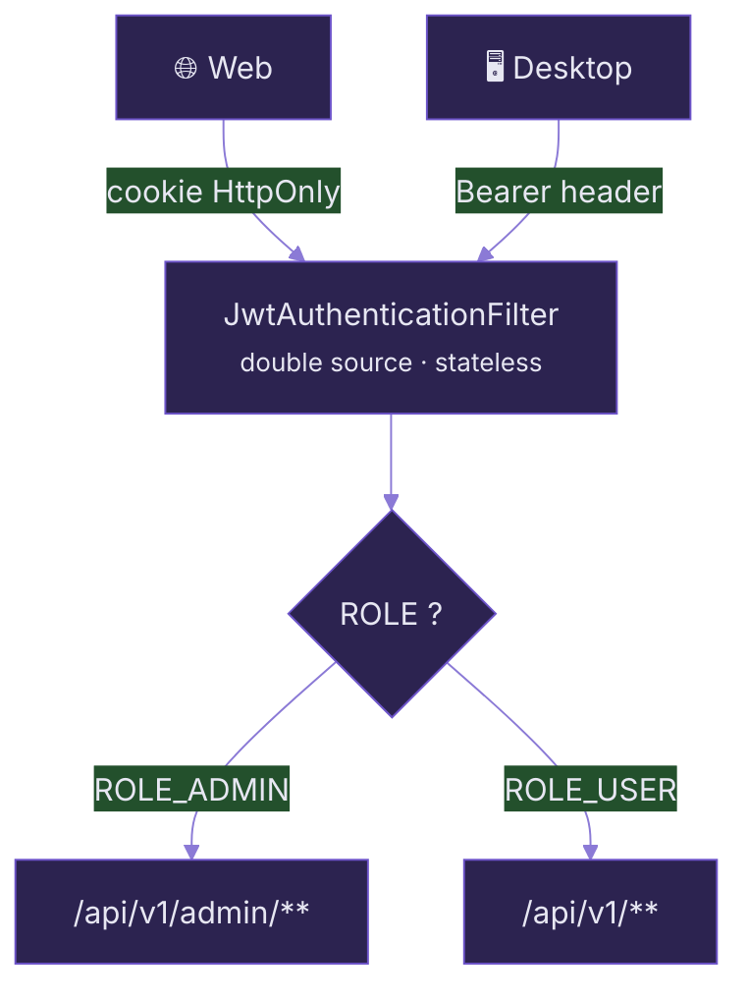
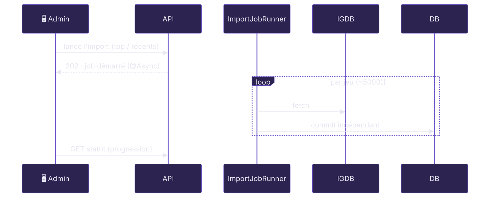
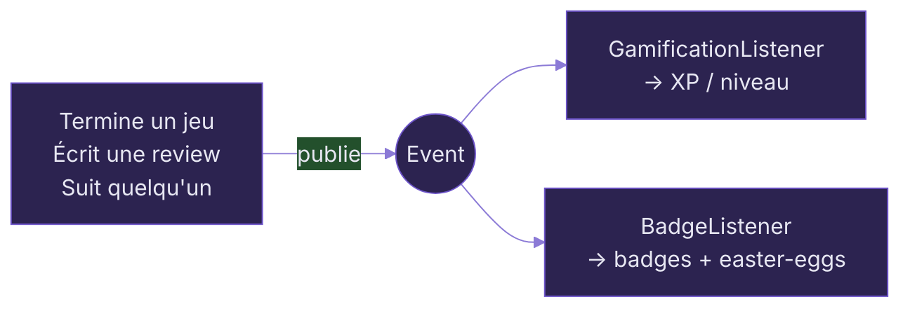

# Implémentations significatives

Au-delà du CRUD : sécurité, recherche, import, gamification, social, temps réel.

---
layout: default
---

# Authentification hybride &amp; sécurité

  <GlowCard icon="i-carbon-two-factor-authentication" title="JWT à double source">
  Un même filtre lit le token dans l'en-tête <code>Authorization: Bearer</code> (Desktop) <strong>ou</strong> le cookie <strong>HttpOnly</strong> <code>checkpoint_token</code> (Web).
  </GlowCard>
  

    
<carbon:password class="inline"/> <strong>2FA e-mail</strong> — code 6 chiffres + token intermédiaire

    
<carbon:user-role class="inline"/> <strong>RBAC</strong> — <code>@EnableMethodSecurity</code> + règles d'URL

    
<carbon:locked class="inline"/> <strong>BCrypt</strong> — hachage des mots de passe

    
<carbon:logo-discord class="inline"/> <strong>OAuth2 / OIDC</strong> + refresh tokens

  

Deux <code>SecurityFilterChain</code> ordonnées : WebSocket (order 0) · API (order 1).

<carbon:game-console class="inline"/> <strong>Connexion Steam</strong> (OpenID) pour importer la bibliothèque Steam du joueur.

<!--
Le point fort : un seul backend, une seule chaîne stateless, mais deux modes
de transport du JWT pour deux clients aux contraintes différentes.
-->

---
layout: two-cols
layoutClass: gap-8
---

# Recherche full-text

**Hibernate Search + Lucene**

  <GlowCard icon="i-carbon-search" title="Index Lucene local">
  Indexation via Hibernate Search, en local.
  </GlowCard>
  
<code>SearchIndexer</code> (<code>CommandLineRunner</code>) reconstruit l'index complet <strong>au démarrage</strong> → recherche dispo immédiatement.

  
<carbon:character-whole-number class="inline"/> Recherche <strong>floue</strong> (tolérante aux fautes) + filtres multicritères.

::right::

# Recommandation &amp; social

  <GlowCard icon="i-carbon-network-4" title="Jeux similaires" color="oklch(0.64 0.15 233)">
  Algorithme <strong>item-to-item</strong> : recouvrement de tags (genres / plateformes / studios) + bonus note &amp; récence.
  </GlowCard>
  <GlowCard icon="i-carbon-collaborate" title="Joueurs compatibles" color="oklch(0.66 0.16 60)">
  Filtrage collaboratif sur les jeux <strong>terminés en commun</strong>.
  </GlowCard>
  
<carbon:activity class="inline"/> Feed d'activité, follow/followers, comparaison de profils.

---
layout: default
---

# Import de catalogue asynchrone (IGDB)

  
<carbon:batch-job class="inline" style="color:oklch(0.7 0.15 286)"/> <strong>Job async</strong> — <code>@Async</code>, pas d'appelant HTTP qui attend.

  
<carbon:checkmark class="inline" style="color:oklch(0.67 0.16 137)"/> <strong>Commit par jeu</strong> — un échec réseau n'annule pas tout.

  
<carbon:repeat class="inline"/> <strong>Idempotence</strong> — pas de doublons en base.

  
<carbon:progress-bar-round class="inline"/> <strong>Progression</strong> exposée via l'API.

> 💡 Le plus dur : passer d'une approche transactionnelle classique à un modèle **« commit par item »** pour ne rien perdre sur une erreur IGDB à mi-parcours.

<!--
On a choisi un runner async maison plutôt que Spring Batch : même résilience,
beaucoup moins de complexité.
-->

---
layout: default
---

# Gamification événementielle

Architecture **event-driven** — `events/` (17 événements) + `listeners/`.

  <GlowCard icon="i-carbon-trophy" title="XP, niveaux, badges">
  Un listener <strong>asynchrone</strong> attribue l'XP à chaque événement publié.
  </GlowCard>
  <GlowCard icon="i-carbon-security" title="Anti-triche intégré" color="oklch(0.58 0.18 27)">
  <strong>Déduplication par clé</strong> — resuivre ne re-crédite pas. <strong>Plafonds glissants</strong> : max 10 « review likée » / 24 h.
  </GlowCard>
  
<carbon:star class="inline" style="color:oklch(0.66 0.16 60)"/> Badges débloqués par événement — y compris des <strong>easter-eggs</strong> cachés.

---
layout: default
---

# Temps réel &amp; tâches planifiées

<GlowCard icon="i-carbon-notification" title="WebSockets (STOMP)" color="oklch(0.64 0.15 233)">
Notifications en <strong>temps réel</strong> poussées au client.
</GlowCard>

<GlowCard icon="i-carbon-time" title="Tâches @Scheduled" color="oklch(0.66 0.16 60)">
Import de news (RSS / Steam), refresh des profils Steam, nettoyage des refresh tokens.
</GlowCard>

<GlowCard icon="i-carbon-locked" title="ShedLock" color="oklch(0.58 0.21 286)">
Verrou <strong>distribué</strong> : une tâche planifiée ne s'exécute <strong>qu'une fois</strong>, même avec plusieurs instances.
</GlowCard>

<carbon:idea class="inline" style="color:oklch(0.66 0.18 286)"/> ShedLock est déjà un <strong>choix « multi-instances »</strong> : on prépare le terrain pour le scaling horizontal (voir §05).

