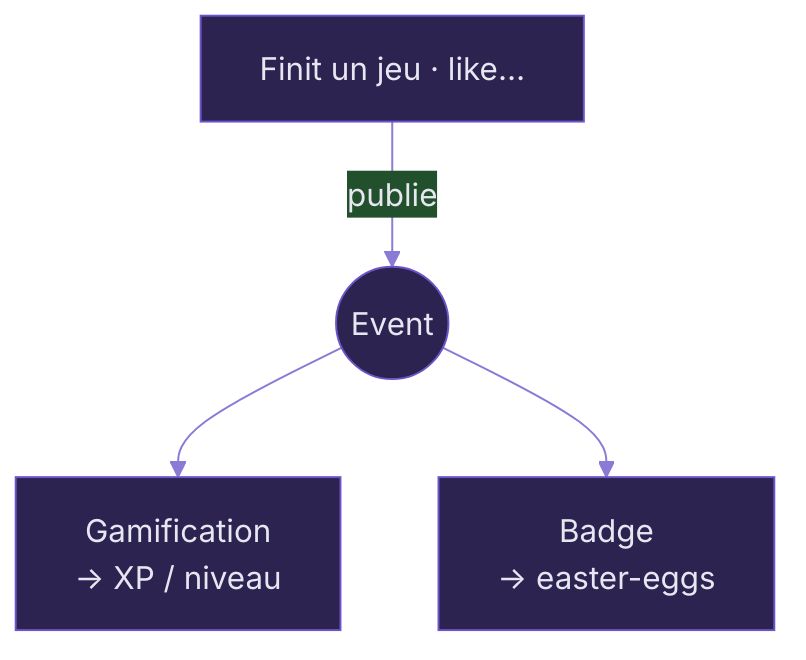

# <span class="cp-accent-bar">① JWT à double source — un backend, deux clients</span>

<div class="grid grid-cols-[1.15fr_1fr] gap-5 mt-6">

<div>

```java {all|3-6|8-15|17}{lines:true}
// JwtAuthenticationFilter — un seul filtre, deux transports
private String extractToken(HttpServletRequest request) {
    // 1. Desktop → en-tête Authorization: Bearer <token>
    String header = request.getHeader("Authorization");
    if (header != null && header.startsWith(BEARER_PREFIX)) {
        return header.substring(BEARER_PREFIX.length());
    }
    // 2. Web → cookie HttpOnly "checkpoint_token" (anti-XSS)
    Cookie[] cookies = request.getCookies();
    if (cookies != null) {
        for (Cookie cookie : cookies) {
            if (COOKIE_NAME.equals(cookie.getName())) {
                return cookie.getValue();
            }
        }
    }
    return null; // pas de token → requête anonyme
}
```

</div>

<div class="flex flex-col gap-2 text-[0.8rem]">

<GlowCard v-click icon="i-carbon-two-factor-authentication" title="Header d'abord, cookie en fallback">
Le backend reste <strong>agnostique</strong> du type de client : le web envoie un cookie, le desktop un header.
</GlowCard>

<div v-click class="cp-card cp-card-ic !p-2.5"><carbon:cloud class="inline" style="color:oklch(0.7 0.15 286)"/> Deux <code>SecurityFilterChain</code> ordonnées (WebSocket · API), toutes deux en <code>SessionCreationPolicy.<strong>STATELESS</strong></code> → aucune session serveur.</div>

<div v-click class="cp-card cp-card-ic !p-2.5"><carbon:locked class="inline"/> Cookie <strong>HttpOnly + SameSite</strong> : illisible en JS (anti-XSS), pas de localStorage.</div>

<div v-click class="cp-card cp-card-ic !p-2.5"><carbon:user-role class="inline"/> <strong>RBAC</strong> + 2FA (token intermédiaire) · <strong>BCrypt</strong> · OAuth2.</div>

</div>

</div>

<div class="text-[0.78rem] cp-dim mt-4"><carbon:idea class="inline"/> <strong>SOLID en pratique :</strong> le filtre dépend d'abstractions (<code>JwtService</code>, <code>UserDetailsService</code>) — pas d'implémentations concrètes.</div>

<!--
Premier morceau de code. Le point clé : un seul filtre de 15 lignes sert deux
clients aux contraintes différentes. Et la ligne STATELESS, c'est ce qui rend
l'API multi-instances — on y reviendra dans la partie cloud-native.
-->

---
layout: default
---

# <span class="cp-accent-bar">② Import asynchrone résilient (~5000 jeux)</span>

<div class="grid grid-cols-[1.25fr_1fr] gap-5 mt-6">

<div>

```java {all|1-2|6|8-11|16-17}{lines:true}
@Async("importExecutor")           // thread dédié, hors requête HTTP
public void run(ImportJobStatus job) {
    job.setState(RUNNING);
    try {
        var games = igdb.fetch(job.getType());
        gameImportService.bulkImport(games, job);   // boucle commit-par-jeu
    } catch (Exception e) {
        job.setErrorMessage(e.getMessage());
        job.setState(FAILED);      // erreur capturée, pas propagée
    }
}

// GamePersistenceService — chaque jeu dans SA transaction
@Transactional(propagation = Propagation.REQUIRES_NEW)
public VideoGame importOne(IgdbGameDto dto, ...) {
    var game = repo.findByIgdbId(dto.id())   // upsert idempotent
        .map(g -> update(g, dto)).orElseGet(() -> create(dto));
    return repo.save(game);
}
```

</div>

<div class="flex flex-col gap-2 text-[0.8rem]">

<GlowCard v-click icon="i-carbon-batch-job" title="Async + thread dédié">
L'admin reçoit <code>202</code> immédiatement. L'<code>importExecutor</code> est <strong>mono-thread</strong> : il sérialise les imports et ne bloque pas la gamification.
</GlowCard>

<GlowCard v-click icon="i-carbon-checkmark" title="Commit par jeu (REQUIRES_NEW)" color="oklch(0.67 0.16 137)">
Un échec réseau IGDB au jeu n°3001 <strong>ne perd pas</strong> les 3000 déjà commités.
</GlowCard>

<div v-click class="cp-card cp-card-ic !p-2.5"><carbon:repeat class="inline"/> <strong>Idempotent</strong> (upsert par <code>igdbId</code>) → relançable sans doublon.</div>

</div>

</div>

<div class="text-[0.78rem] cp-dim mt-4"><carbon:idea class="inline"/> Spec : Spring Batch. On a choisi un runner async maison → <strong>même résilience, bien moins de complexité</strong>.</div>

<!--
Le plus dur du projet : passer d'une transaction unique à "un commit par item".
REQUIRES_NEW, cette annotation-là, c'est notre résilience.
-->

---
layout: default
---

# <span class="cp-accent-bar">③ Gamification événementielle &amp; anti-triche</span>

<div class="grid grid-cols-[1.25fr_1fr] gap-5 mt-6">

<div>

```java {all|1-2|4-6|7|10-14}{lines:true}
@Async @EventListener     // autre thread → ne ralentit pas l'action
public void onReviewLiked(ReviewLikedEvent e) {
    // Niveau 2 — plafond glissant 24h
    long last24h = xpGrantRepository.countByUserIdAndEventTypeAfter(
        e.getReviewAuthorId(), REVIEW_LIKED, now().minusHours(24));
    if (last24h >= REVIEW_LIKED_DAILY_CAP) return;   // max 10 / 24h
    awardXp(e.getReviewAuthorId(), 5, REVIEW_LIKED, e.getLikeId());
}

// Niveau 1 — dédup par CONTRAINTE D'UNICITÉ en base
try {
    xpGrantRepository.saveAndFlush(new XpGrant(user, type, targetId, xp));
} catch (DataIntegrityViolationException ex) {
    return;   // clé (user, type, target) déjà accordée → on saute
}
```

</div>

<div class="flex flex-col gap-2 text-[0.8rem]">



<GlowCard v-click icon="i-carbon-security" title="Anti-triche à 2 niveaux" color="oklch(0.58 0.18 27)">
Dédup en <strong>base</strong> (atomique, anti-concurrence) + <strong>plafond glissant</strong> 24h. Resuivre ne re-crédite pas.
</GlowCard>

</div>

</div>

<div class="text-[0.78rem] cp-dim mt-4"><carbon:idea class="inline"/> <strong>Découplage (SOLID/OCP) :</strong> ajouter une réaction = ajouter un listener, sans toucher au code métier.</div>

<!--
Architecture event-driven : le code métier publie un événement, plusieurs listeners
réagissent. La dédup est en base et pas en Java pour éviter une race condition.
-->

---
layout: default
---

# <span class="cp-accent-bar">④ Recommandation item-to-item</span>

<div class="grid grid-cols-[1.2fr_1fr] gap-5 mt-6">

<div>

```java {all|2-4|5-6}{lines:true}
// GameTagScorer — score par recouvrement de tags
double total = genreContribution      // genres × 1.0  (signal fort)
             + companyContribution    // studios × 0.6
             + platformContribution   // plateformes × 0.4
             + rating * 0.2           // départage par la note
             + recency;               // +0.5 si sorti < 2 ans

// Garde-fou : un IN () vide plante certains dialectes Hibernate
static Collection<UUID> ensureNonEmpty(Set<UUID> ids) {
    return ids.isEmpty() ? List.of(new UUID(0, 0)) : ids;
}
```

</div>

<div class="flex flex-col gap-2 text-[0.8rem]">

<GlowCard v-click icon="i-carbon-network-4" title="Pré-filtre SQL puis scoring">
La base ramène ≤ <strong>50 candidats</strong> partageant un genre/studio ; on les score finement <strong>en mémoire</strong>, on trie, on garde le top 12.
</GlowCard>

<div v-click class="cp-card cp-card-ic !p-2.5"><carbon:reset class="inline"/> Poids isolés en constantes → <strong>réglables</strong> sans toucher à la logique.</div>

<div v-click class="cp-card cp-card-ic !p-2.5"><carbon:share class="inline" style="color:oklch(0.67 0.16 137)"/> <strong>DRY</strong> : le même scorer sert « jeux similaires » <strong>et</strong> recos personnalisées.</div>

</div>

</div>

<div class="text-[0.78rem] cp-dim mt-4"><carbon:idea class="inline"/> Spec : TF-IDF. Notre tag-overlap est plus simple à expliquer/régler et pertinent sur notre volume.</div>

<!--
Quatrième morceau. C'est du filtrage par contenu, pas du ML. On laisse la base
pré-filtrer (ce qu'elle fait de mieux) et on score un petit pool en Java.
Le détail ensureNonEmpty, c'est un vrai bug évité en prod sur données incomplètes.
-->
