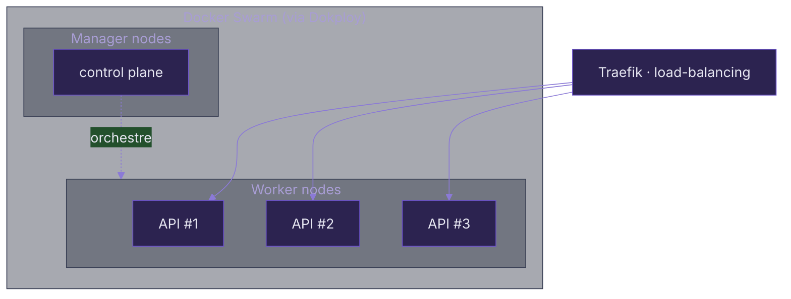

# <span class="cp-accent-bar">Pensé cloud-native — les principes</span>

<div class="text-[0.85rem] mt-6 mb-3">Le <strong>fil conducteur</strong> architectural du projet. On se mesure honnêtement aux principes cloud-native :</div>

<div class="grid grid-cols-2 gap-x-6 gap-y-2 text-[0.84rem]">

<div class="cp-card cp-card-ic !p-2.5"><carbon:checkmark-filled class="inline" style="color:oklch(0.67 0.16 137)"/> <strong>Conteneurisation</strong> — Docker</div>
<div class="cp-card cp-card-ic !p-2.5"><carbon:checkmark-filled class="inline" style="color:oklch(0.67 0.16 137)"/> <strong>Orchestration dynamique</strong> — Docker Swarm (Dokploy)</div>
<div class="cp-card cp-card-ic !p-2.5"><carbon:checkmark-filled class="inline" style="color:oklch(0.67 0.16 137)"/> <strong>Scalabilité horizontale</strong> — stateless JWT</div>
<div class="cp-card cp-card-ic !p-2.5"><carbon:checkmark-filled class="inline" style="color:oklch(0.67 0.16 137)"/> <strong>Résilience</strong> — commit-par-jeu, ShedLock</div>
<div class="cp-card cp-card-ic !p-2.5"><carbon:checkmark-filled class="inline" style="color:oklch(0.67 0.16 137)"/> <strong>Automatisation CI/CD</strong> — GitHub Actions + déploiement Git-driven</div>
<div class="cp-card cp-card-ic !p-2.5"><carbon:in-progress class="inline" style="color:oklch(0.66 0.16 60)"/> <strong>État externalisé</strong>  — Postgres, fichiers → S3 🔜</div>

</div>

<div v-click class="mt-4 cp-card !p-3 text-[0.86rem]" style="border-color: oklch(0.5 0.12 27)">
<carbon:close-filled class="inline" style="color:oklch(0.62 0.2 27)"/> <strong>Microservices ? Non — et c'est assumé.</strong> CheckPoint est un <strong>monolithe modulaire</strong>. Le cloud-native n'impose pas les microservices : on a la conteneurisation, le stateless et la scalabilité <strong>sans</strong> la complexité distribuée.
</div>

<!--
On ne coche pas tout par principe : on se mesure honnêtement. Le point assumé,
c'est qu'on n'est pas en microservices — un monolithe modulaire suffit et évite
la complexité distribuée. Le cloud-native ne l'impose pas.
-->

---
layout: default
---

# <span class="cp-accent-bar">Pourquoi on a retiré les sessions</span>

<div class="text-[0.85rem] mt-6 mb-3">Le cahier des charges prévoyait une auth <strong>stateful</strong> (session). On a fait le choix inverse : <strong>tout est stateless (JWT)</strong>.</div>

<div class="grid grid-cols-2 gap-6">

<GlowCard icon="i-carbon-data-base-alt" title="Stateful (session)" color="oklch(0.58 0.18 27)">

État d'auth stocké **en mémoire serveur**. Avec plusieurs instances :

<div class="flex flex-col gap-1.5 mt-2 text-[0.78rem]">
  <div>❌ sticky sessions <strong>ou</strong> store externe (Redis…)</div>
  <div>❌ complexité &amp; point de contention</div>
  <div>❌ une instance devient « spéciale »</div>
</div>

</GlowCard>

<GlowCard v-click icon="i-carbon-cloud" title="Stateless (JWT) — notre choix">

L'API **ne garde aucun état** : le JWT porte l'identité, validé à chaque requête.

<div class="flex flex-col gap-1.5 mt-2 text-[0.78rem]">
  <div>✅ n'importe quelle instance traite n'importe quelle requête</div>
  <div>✅ <strong>scaling horizontal</strong> sans config de partage d'état</div>
  <div>✅ sécurité web : cookie <strong>HttpOnly + SameSite</strong></div>
</div>

</GlowCard>

</div>

> 💡 On a supprimé les sessions **pour que l'app soit nativement multi-instances** : aucune instance n'est spéciale, on en ajoute ou retire à chaud.

---
layout: default
---

# <span class="cp-accent-bar">Déploiement multi-instances</span>

<div class="grid grid-cols-[1.2fr_1fr] gap-6 mt-6">

<div>



</div>

<div class="flex flex-col gap-2 text-[0.82rem]">
  <div class="cp-card !p-2.5"><strong>Manager nodes</strong> — orchestrent le cluster, planifient les conteneurs.</div>
  <div class="cp-card !p-2.5"><strong>Worker nodes</strong> — exécutent les conteneurs applicatifs.</div>
  <GlowCard icon="i-carbon-scale" title="Scaler = ajouter des nœuds">
  On ajoute des <strong>workers</strong> (charge) ou des <strong>managers</strong> (HA) <strong>sans retoucher le code</strong> — parce que l'API est stateless.
  </GlowCard>
</div>

</div>

---
layout: default
---

# <span class="cp-accent-bar">Stockage découplé — vers S3</span>

<div class="grid grid-cols-[1fr_1fr] gap-6 mt-6">

<div>

Les uploads sont aujourd'hui sur **disque local**, mais **derrière une interface** `StorageService`. Migrer vers S3 = **une nouvelle implémentation**, sans toucher au reste.

````md magic-move {lines: true}
```java
// 1. Le contrat — tout le code dépend de CETTE interface
public interface StorageService {
    String store(MultipartFile file, String directory);
    void delete(String path);
}
```

```java
// 2. Aujourd'hui — disque local
@Service
public class LocalStorageServiceImpl implements StorageService {
    public String store(MultipartFile file, String directory) {
        // écrit le fichier sur le système de fichiers local
    }
    public void delete(String path) { /* … */ }
}
```

```java
// 3. Demain — S3, AUCUN autre fichier ne change
@Service
public class S3StorageServiceImpl implements StorageService {
    public String store(MultipartFile file, String directory) {
        // PutObject vers un bucket S3 → stockage stateless
    }
    public void delete(String path) { /* … */ }
}
```
````

</div>

<div class="flex flex-col gap-2 text-[0.82rem] justify-center">
  <div class="cp-card cp-card-ic !p-2.5"><carbon:data-backup class="inline"/> <strong>PostgreSQL</strong> sauvegardée vers un <strong>bucket S3</strong> (backups Dokploy).</div>
  <GlowCard icon="i-carbon-cloud-satellite" title="Le dernier verrou" color="oklch(0.66 0.16 60)">
  Tant que les uploads sont sur disque local, deux instances ne partagent pas les fichiers. <strong>Une fois sur S3 → scalabilité complète.</strong>
  </GlowCard>
  <div class="cp-chip"><carbon:in-progress class="inline"/> &nbsp;Issue en cours</div>
</div>

</div>

> 💡 Architecture stateless **côté calcul** ; le seul état restant est dans des services externalisables (Postgres &amp; fichiers) — et la migration S3 finalise le tableau. C'est aussi du **SOLID** : inversion de dépendance + ouvert/fermé.

<!--
L'interface StorageService illustre concrètement SOLID : le reste du code dépend
de l'abstraction. Migrer vers S3 = écrire une implémentation, changer un branchement.
C'est aussi le dernier verrou du full multi-instances.
-->
