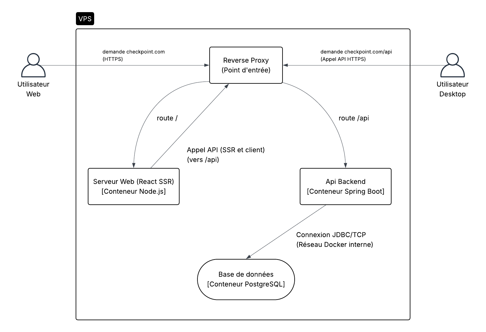
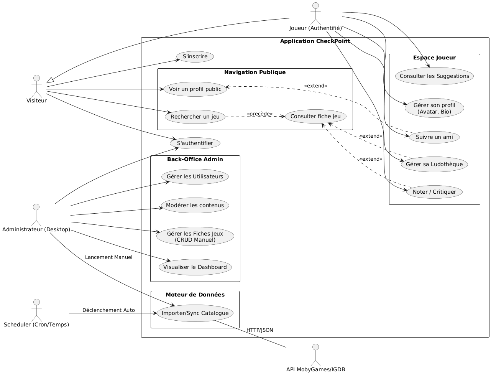
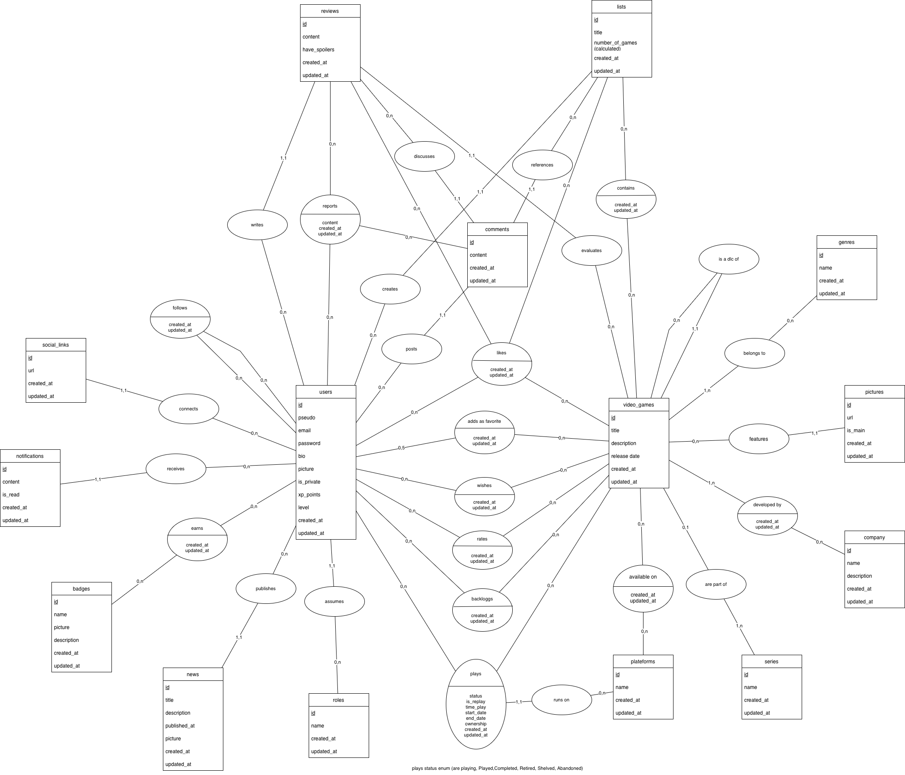
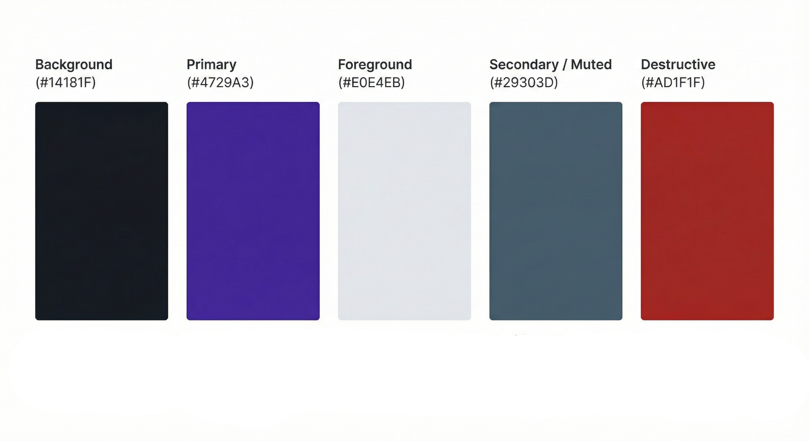
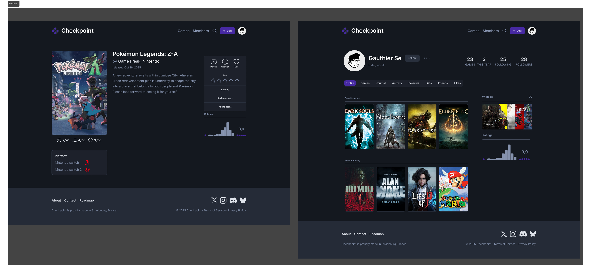
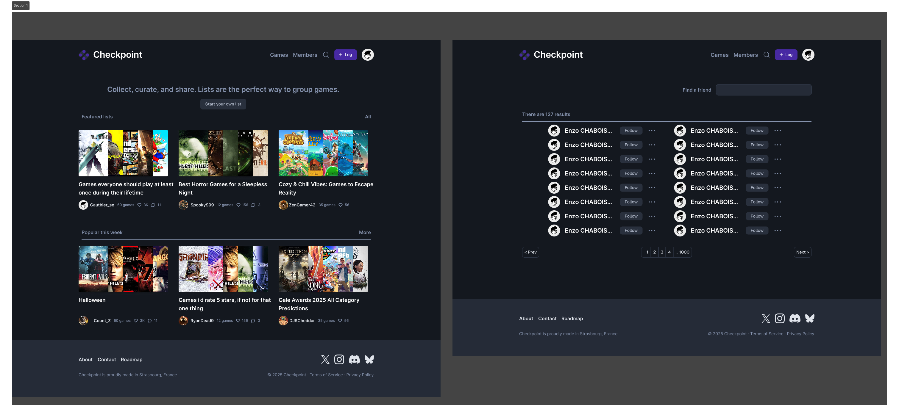

# CHECKPOINT - SPECIFICATIONS DOCUMENT

  

**Authors:**
- Enzo CHABOISSEAU
- Gauthier SEYZERIAT--MEYER

---

## Table of Contents

1. [Project Presentation](#1-project-presentation)
   - [1.1. Context and Challenges](#11-context-and-challenges)
   - [1.2. Project Scope](#12-project-scope)
2. [Software and Technical Architecture](#2-software-and-technical-architecture)
   - [2.1. Global Architecture Schema](#21-global-architecture-schema)
   - [2.2. Technological Choices](#22-technological-choices)
   - [2.3. Security and Data Flow](#23-security-and-data-flow)
3. [Functional Specifications and Acceptance Criteria](#3-functional-specifications-and-acceptance-criteria)
   - [3.1. Data Management](#31-data-management)
   - [3.2. User Space](#32-user-space)
   - [3.3. Administration and Moderation](#33-administration-and-moderation)
   - [3.4. Recommendation Engine](#34-recommendation-engine)
   - [3.5. Use Case Diagram (UML)](#35-use-case-diagram-uml)
4. [Data Modeling](#4-data-modeling)
   - [4.1. Conceptual Data Model (MCD)](#41-conceptual-data-model-mcd)
5. [Interface Design (UI/UX)](#5-interface-design-uiux)
   - [5.1. Style Guide and Ergonomics](#51-style-guide-and-ergonomics)
   - [5.2. Mockups](#52-mockups)
6. [Methodology and Organization](#6-methodology-and-organization)
   - [6.1. Workflow](#61-workflow)
   - [6.2. Planning and Milestones](#62-planning-and-milestones)
   - [6.3. Tracking Tools](#63-tracking-tools)
7. [Quality Strategy](#7-quality-strategy)
   - [7.1. Test Plan](#71-test-plan)
   - [7.2. Quality Indicators](#72-quality-indicators)

---

## 1. Project Presentation

### 1.1. Context and Challenges

#### Project Context

The "CheckPoint" project addresses a concrete need identified among video game players: the fragmentation of their game libraries across multiple platforms. The objective is to offer a centralized solution allowing users to track their progress ("backlog"), manage their "wishlist," and interact with a community, independent of application stores.

#### Technical Challenges

The realization of "CheckPoint" addresses several major engineering challenges:

- **Distributed Architecture**: Secured orchestration between three heterogeneous components: Spring Boot API, TanStack web client, and JavaFX desktop client.
- **Performance and Volume**: Efficient management of importing and indexing thousands of game entries via Spring Batch and Hibernate Search.
- **Hybrid Security**: Implementation of a double authentication strategy adapted to the constraints of the web (session) and desktop (stateless JWT).

### 1.2. Project Scope

#### Application Solutions

The system is based on a strict distributed architecture, articulated around three distinct software components:

| Component | Technology | Description |
|-----------|------------|-------------|
| **REST API** | Spring Boot | The heart of the system. Centralizes business logic, security, and the interface with the database. Exposes services consumed by both clients. |
| **Web Application** | TanStack Start | Interface accessible via a browser. Allows users to consult the catalog, manage their personal library, and interact with the community. |
| **Desktop Application** | JavaFX | Exclusively dedicated to internal management: administration of user accounts, moderation of content, and monitoring of data import flows. |

#### Actors and Roles

The project identifies two types of actors interacting with the system:

| Actor | Access | Permissions |
|-------|--------|-------------|
| **User** | Web application only | Register, search for games, populate their collection, and rate works. |
| **Administrator** | Desktop application (primary) | Elevated rights to manage the game repository, moderate flagged reviews, and manage user access. |

---

## 2. Software and Technical Architecture

### 2.1. Global Architecture Schema

The CheckPoint application is based on a modular and containerized architecture, deployed on a single VPS (Virtual Private Server). All application services run in isolated Docker containers, orchestrated to ensure security and separation of responsibilities.

  

#### Single Point of Entry

All incoming traffic is managed by a Traefik reverse proxy. It acts as the unique entry point for the system, ensuring HTTPS termination for all requests.

| Route | Target | Description |
|-------|--------|-------------|
| `checkpoint.com` | Node.js container | Web application requests |
| `checkpoint.com/api` | Spring Boot container | API requests |

#### Web Interface

The web user accesses the application via their browser. The Node.js web server container hosts the TanStack Start application. It handles server-side rendering to optimize initial performance and SEO. To retrieve dynamic data, the Node.js server and the client browser make calls to the API via the reverse proxy.

#### Desktop Interface & API

The desktop user interacts directly with the backend API. The thick client performs authenticated HTTPS calls directly to the `/api` endpoint exposed by the reverse proxy. The backend API container processes these requests, executes business logic, and manages security.

#### Data Persistence

The PostgreSQL database is isolated in a dedicated container, located on an internal Docker network. It is never exposed directly to the public internet. Only the backend API container is authorized to communicate with it via a JDBC/TCP connection on the private network.

### 2.2. Technological Choices

#### Backend: Spring Ecosystem

| Component | Technology | Purpose |
|-----------|------------|---------|
| Framework | Spring Boot 3 | Robustness, dependency injection container, ease of configuration |
| Security | Spring Security | Authentication and role management |
| Batch Processing | Spring Batch | Massive resilient data import |
| Persistence | Spring Data JPA | Persistence abstraction layer |
| Search | Hibernate Search | Fuzzy full-text search engine |

#### Desktop Frontend: JavaFX

- **Technology**: JavaFX
- **Purpose**: Used exclusively for the administration panel to create a rich, reactive, and strongly typed interface.

#### Web Frontend: TanStack Start

- **Technology**: TanStack Start with React
- **Purpose**: Allows server-side rendering (SSR), offering fast initial loading and better SEO.

#### Persistence and Infrastructure

| Component | Technology |
|-----------|------------|
| Database | PostgreSQL |
| Containerization | Docker (portability between dev/prod) |

### 2.3. Security and Data Flow

CheckPoint relies on a defense-in-depth approach. The implementation relies on the Spring Security framework.

#### Hybrid Authentication Strategy

The API implements a double authentication strategy:

| Flow Type | Client | Method | Storage |
|-----------|--------|--------|---------|
| **Stateless** | Desktop / API | JWT (JSON Web Token) | Local storage, injected in Authorization header |
| **Stateful** | Web | Session authentication | HttpOnly and Secure cookies (XSS protection) |

#### Authorization Management (RBAC)

Access is controlled by a strict Role-Based Access Control system via `@PreAuthorize` annotations:

| Role | Access Level |
|------|-------------|
| `ROLE_USER` | Access to public features |
| `ROLE_ADMIN` | Exclusive access to administration endpoints |

#### Data and Network Protection

| Protection Layer | Implementation |
|-----------------|----------------|
| Encryption in Transit | HTTPS with TLS |
| Database Partitioning | Isolated in private Docker network |
| Password Security | Hashed and salted via BCrypt algorithm |
| Input Validation | DTOs annotated with Jakarta Validation |

#### GDPR Compliance and Privacy

| Principle | Implementation |
|-----------|----------------|
| Right to be Forgotten | API endpoint for full data deletion or anonymization |
| Minimization | Only strictly necessary data is stored |
| Transparency | User can download a JSON export of all their data |

---

## 3. Functional Specifications and Acceptance Criteria

### 3.1. Data Management

#### Automated Import and Synchronization

> **User Story**: *"As an administrator, I want to launch an import process, to populate and update the local database with the latest game releases without manual entry."*

**Acceptance Criteria:**
- Job architecture (reader, processor, writer)
- Quota management (rate limiting)
- Idempotency (no duplicates)
- Monitoring via API

#### Advanced Search Engine

> **User Story**: *"As a user, I want to find a game by typing its name, even incompletely or with typos."*

**Acceptance Criteria:**
- Fuzzy Search
- Multi-criteria filtering
- Quasi-real-time index synchronization

#### Manual Management and Fallback

> **User Story**: *"As an administrator, I want to manually create or modify a game entry via the Desktop interface."*

**Acceptance Criteria:**
- Dedicated JavaFX form
- Integrity controls preventing the deletion of referenced games

### 3.2. User Space

#### Account Authentication and Security

> **User Story**: *"As a user, I want to connect securely and receive a verification code if I connect from a new device."*

**Acceptance Criteria:**
- Registration/login with real-time validation
- Session security (HttpOnly/Secure)
- 2FA (6-digit email code)
- Profile management (avatar, bio)

#### Library Management

> **User Story**: *"As a player, I want to classify games into different lists (in progress, finished, wishlist) to track my progress."*

**Acceptance Criteria:**
- Quick actions (add to wishlist, mark as finished)
- Personal filtering page
- Quick rating system

#### Social Interactions and Gamification

> **User Stories**: *Follow friends and write reviews; earn XP to unlock badges.*

**Acceptance Criteria:**
- Rich text review editor
- Follow System with activity feed
- Event-driven gamification engine for XP
- Visual badges on profile

### 3.3. Administration and Moderation

#### User and Role Management

> **User Story**: *"As an administrator, I want to search for a user and be able to block them temporarily or permanently."*

**Acceptance Criteria:**
- JavaFX TableView dashboard
- Administration menu (Block/Unblock, Promote)
- Activity history view

#### Content Moderation

> **User Story**: *"As a moderator, I want to access a list of reported reviews to decide on their deletion."*

**Acceptance Criteria:**
- Priority-sorted report queue
- Split-view decision interface
- Actions (Delete with notification, or Ignore)

#### Data Piloting and Monitoring

> **User Story**: *"As an administrator, I want to manually trigger synchronization with the MobyGames API and follow the progress in real time."*

**Acceptance Criteria:**
- Manual Batch trigger button
- Visual monitoring (progress bar for Spring Batch Job)
- Error log console in JavaFX

#### Analytical Dashboard

> **User Story**: *"As an administrator, I want to visualize the evolution of the number of registered users and the distribution of popular genres through charts."*

**Acceptance Criteria:**
- JavaFX PieChart and LineChart components
- Fueled by optimized API endpoints

### 3.4. Recommendation Engine

#### Content Recommendation

> **User Story**: *"As a user, I want to see a list of similar games when I consult a title's entry."*

**Acceptance Criteria:**
- Semantic algorithm (TF-IDF via Hibernate Search)
- "You might also like" carousel sorted by similarity score

#### Social Recommendation

> **User Story**: *"As a user, I want to receive friend suggestions to expand my social network."*

**Acceptance Criteria:**
- Collaborative filtering based on finished games
- Implemented via optimized SQL
- "Compatible players" widget

### 3.5. Use Case Diagram (UML)

  

**Actors:**
- **Human**: Visitor, Authenticated Player (inherits from Visitor), Desktop Administrator
- **System**: Scheduler (Cron), MobyGames/IGDB API

**Use Cases:**
- Public Navigation (Search/View game)
- Player Space (Manage profile, Follow friends, Manage library, Rate/Review)
- Back-Office Admin (Manage users, Moderate content, CRUD game entries, View Dashboard)
- Data Engine (Sync Catalogue triggered by Admin or Scheduler)

---

## 4. Data Modeling

### 4.1. Conceptual Data Model (MCD)

  

#### Structure Analysis

| Domain | Key Entities | Description |
|--------|--------------|-------------|
| **Gaming Repository** | `video_games`, `genres`, `platforms`, `companies` | Centralized and normalized game catalog |
| **Library Tracking** | `plays` (associative entity) | Carries status, play time, and platform attributes |
| **Social & Community** | `reviews`, `comments`, `likes`, `reports`, `follows` | User interactions and moderation |
| **Gamification** | `xp_points`, `level`, `badges`, `earns` | Player progression system |

---

## 5. Interface Design (UI/UX)

### 5.1. Style Guide and Ergonomics

CheckPoint adopts a dark theme by default, drawing inspiration from Discord, Steam, and Twitch.

#### Visual Identity

**Logotype**: Geometric abstraction representing a stylized controller and connected checkpoints.

#### Color Palette

  

| Color Name | Hex Code | Usage |
|------------|----------|-------|
| Background | `#14181F` | Deep blue-grey |
| Primary | `#4729A3` | Intense violet |
| Foreground | `#E0E4EB` | Off-white |
| Secondary/Muted | `#29303D` | Secondary elements |
| Destructive | `#AD1F1F` | Error/danger states |

#### Typography

**Font Family**: Inter (modern sans-serif)

#### Design System

| Platform | Framework | Purpose |
|----------|-----------|---------|
| Web | Shadcn UI (React/Tailwind) | Accessibility and consistency |
| Desktop | Custom JavaFX CSS | Mirror the web's visual style |

### 5.2. Mockups

#### Web Dashboard & Game Catalog

  

#### Game Detail & User Profile

  

#### Lists/Curation & Community Members

  

---

## 6. Methodology and Organization

### 6.1. Workflow

The project adopts the **GitHub Flow** methodology. The `main` branch is the unique source of truth. Linear is used for project management.

#### Branch Protection Rules

- ❌ No direct pushes to `main`
- ✅ Mandatory code review (at least 1 approval)
- ✅ Status checks must be green (automated tests)

#### Naming Conventions

| Type | Pattern | Example |
|------|---------|---------|
| Feature | `feature/CHK-{ID}-{name}` | `feature/CHK-42-user-auth` |
| Bugfix | `fix/CHK-{ID}-{name}` | `fix/CHK-15-login-error` |
| Chore | `chore/CHK-{ID}-{name}` | `chore/CHK-8-update-deps` |

### 6.2. Planning and Milestones

The project runs from **November 19, 2025, to June 3, 2026**.

| Phase | Period | Objectives |
|-------|--------|------------|
| **Phase 1: Technical Base** | Nov-Dec 2025 | Infrastructure, Docker, Spring Batch, MVP Authentication |
| **Phase 2: Functional Core** | Jan 2026 | Hibernate Search, social/gamification, JavaFX moderation |
| **Phase 3: Design & UI/UX** | Feb-Apr 2026 | Responsive web design, JavaFX styling, analytics |
| **Phase 4: Quality & Delivery** | May-Jun 2026 | WebSockets, final tests (70% coverage), defense on June 3 |

### 6.3. Tracking Tools

| Tool | Purpose |
|------|---------|
| **Linear** | Backlog, User Stories, Cycles, and Tasks |
| **GitHub** | Source code, traceability, Wiki documentation |
| **Discord** | Daily sync points |

---

## 7. Quality Strategy

### 7.1. Test Plan

| Test Type | Tools | Scope |
|-----------|-------|-------|
| **Unit Tests** | JUnit 5, Mockito | Isolated business services |
| **Integration Tests** | Spring Boot Test, Testcontainers | REST controllers, Batch jobs, JPA queries |
| **Automation** | GitHub Actions | Pipeline triggered on every push/PR |

### 7.2. Quality Indicators

| Indicator | Tool | Target |
|-----------|------|--------|
| Static Analysis | SonarLint | Duplication < 5%, vulnerability detection |
| Code Coverage | JaCoCo | > 60% on business services |
| API Documentation | Swagger / OpenAPI | Automatic interactive documentation |

#### Coding Standards

| Context | Convention | Example |
|---------|------------|---------|
| Java classes / React types | PascalCase | `UserService`, `GameCard` |
| Methods / Hooks | camelCase | `getUserById()`, `useGameList()` |
| PostgreSQL tables | snake_case | `video_games`, `user_badges` |
